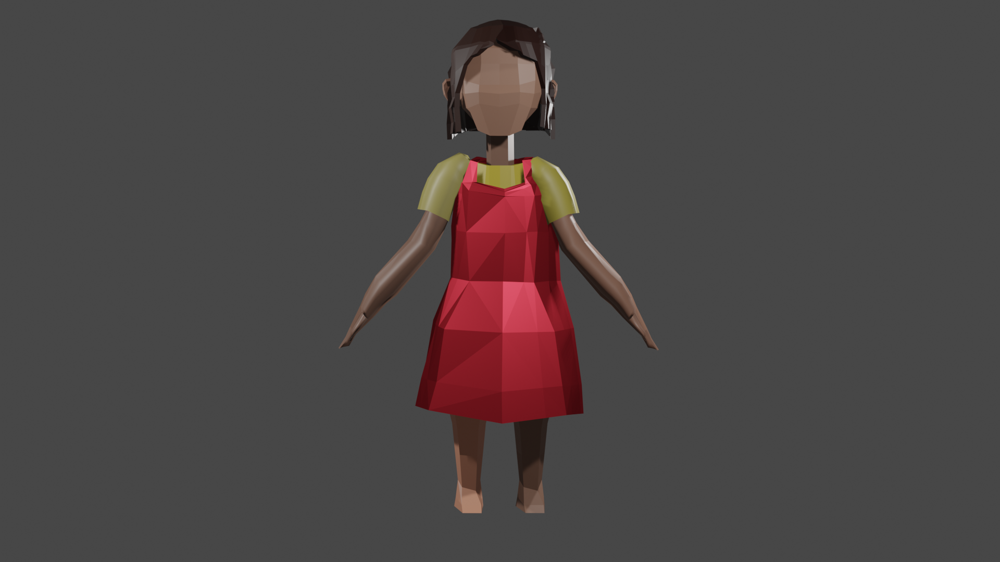

## Small project in blender - modelling Heidi world ##
### Course [Introduction to Computer Graphics (780.214, 23S) by Mathias Lux](http://www.itec.uni-klu.ac.at/~mlux/index.php?id=courses/intro-cg-ss20.md).
---

### Result
- Heidi

---

- Animation
  
https://github.com/wkzawadzka/heidi-blender/assets/49953771/9c26394a-9f86-464a-afe0-4203a1db04ad

---
### Sources
Adobe. “Mixamo.” Accessed June 11, 2023. https://www.mixamo.com/#/.

AnimazaStudios. “Extend a Walk Cycle from Mixamo in Blender and 3ds Max.” Youtube, 2022. https://www.youtube.com/watch?v=Mye4s2ABPEo.

GArtist. “Blender Tutorial of Procedural wood grain texture.” Youtube, 2021. https://www. youtube.com/watch?v=Kry_9dq3M4Y.

PIXXO3D. “Blender MODELLING For Absolute Beginners | Low Poly Girl.” Youtube, 2022. https://www.youtube.com/watch?v=sbCW0Cs7aI8.
